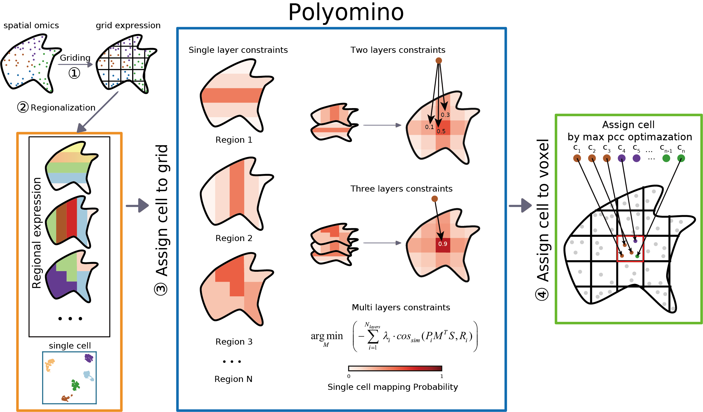

</a>
Mapping cell locations via multi-layer regionalization constraints
[](https://pypi.org/project/Polyomino-sc/)
[](https://polyomino.readthedocs.io/en/latest/)
=========================================================================

Introduction
------------
Resolving spatial cell arrangement is crucial for understanding physiological and pathological processes. While scRNA-seq captures gene expression at single-cell resolution, it loses spatial context, and current spatial transcriptomics methods often compromise on throughput or resolution. Existing integration methods face challenges with accuracy and scalability due to noise from molecular diffusion, cell segmentation errors, and disproportionate cell-type representation. We present Polyomino, an algorithm framework employing multi-layered regional constraints to accurately assign cell locations, enhancing spatial accuracy and resilience to noise. Comparative analysis on benchmark datasets demonstrates Polyomino’s superior accuracy and scalability over existing methods. Applied to liver cancer tissue, Polyomino revealed spatial heterogeneity of cDC cells, a detail missed by deconvolution-based techniques, and achieved cell-cell interaction resolution beyond traditional mapping approaches. Additionally, Polyomino outperforms current techniques in computational efficiency and resource usage, particularly with large-scale stereo-seq data, underscoring its potential for broad application.



Installation
------------
Polyomino can be installed either through GitHub or PyPI.

To install from GitHub:

    git clone https://github.com/caiquanyou/Polyomino
    cd Polyomino
    python setup.py install # or pip install .

Alternatively, install via PyPI using:

    pip install Polyomino-sc

Usage
-----
After installation, Polyomino can be used in Python as follows:
 ```python
    import Polyomino as po
    import scanpy as sc
    scdata = sc.read_h5ad('/Path/to/scdata.h5ad')
    stdata = sc.read_h5ad('/Path/to/stdata.h5ad')
    stdata_grid = po.generate_grid(stdata,width=none)
    po_object = po.Polyomino(scdata,stdata_grid,cluster_time=1,device='cpu')
    po_object.allocate()
    cell_alocated_data = po.sc2sc(scdata, stdata, zm_object.spot_matrix,thres=0.1,method='max')
 ```
Also can running in terminal:
 ```bash
Polyomino \
    -sc SC_path \
    -st ST_path \
    -w Width_of_grid \
    [-o OUTPUT] \
    [--cluster_time CLUSTER_TIME] \
    [--custom_region CUSTOM_REGION] \
    [--cluster_thres CLUSTER_THRES] \
    [--thres THRES] \
    [--method {max,lap}] \
    [--device {cpu,cuda}]
 ```

## Platform-specific Usage Guides

Polyomino supports multiple spatial transcriptomics platforms, each requiring specific preprocessing steps to ensure accurate mapping. To facilitate reproducibility and ease of use across diverse datasets, we provide detailed, platform-specific usage guides.

These guides include:
- Data preprocessing steps (e.g., format conversion, filtering)
- Recommended voxel size settings
- Example scripts for integration
- Notes on performance considerations

You can find the usage guides in the [`platform_guides/`](https://github.com/caiquanyou/Polyomino/tree/main/platform_guides) directory of the repository.

Supported platforms:

- **[10x Genomics Visium](https://github.com/caiquanyou/Polyomino/blob/main/platform_guides/Visium.md)**  
  Instructions for processing Space Ranger output and generating voxel grids. Typical voxel size: 50–100 μm.

- **[BGI Stereo-seq](https://github.com/caiquanyou/Polyomino/blob/main/platform_guides/Stereo-seq.md)**  
  Covers bin-level expression data (e.g., bin50), handling sparse matrices, and resource optimization for large-scale mapping.

- **[STARmap](https://github.com/caiquanyou/Polyomino/blob/main/platform_guides/STARMAP.md)**  
  Describes single cell level expression data, coordinate normalization, and specific recommendations for high-resolution datasets.

These guides will be continuously updated based on user feedback and software improvements. If you encounter any issues or have suggestions, please open an issue on our [GitHub Issues page](https://github.com/caiquanyou/Polyomino/issues).


Contributing
------------
Contributions to Polyomino are welcome. Please refer to the project's issues and pull requests for areas where you can help.

License
-------
**Free Software**

Support and Contact
-------------------
For support or to contact the developers, please use the project's GitHub Issues page.
